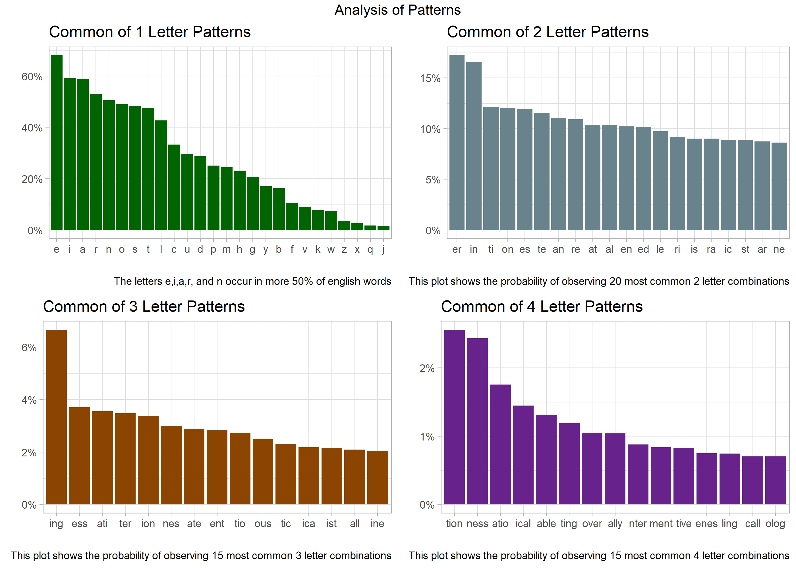
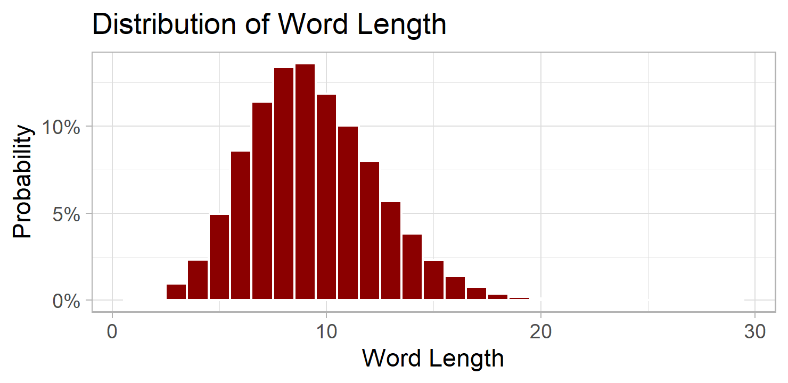

# Introduction

The game of Hangman, a classic word-guessing game, has been a subject of interest in various fields due to its inherent linguistic and computational challenges. As part of the selection process for a summer internship at TrexQuant, the task was presented to create an algorithm that significantly outperforms a base model in playing Hangman. The objective of this challenge was to design an algorithm to achieve an accuracy rate exceeding 50%.

In this report, I present a comprehensive analysis of the development process, methodology, and results achieved in designing my Hangman-playing algorithm. My approach focused on exploiting patterns in English words, utilizing conditional probabilities, and employing statistical techniques to create a sophisticated model capable of achieving a higher success rate in guessing the correct letters. By combining these strategies and rigorously evaluating the algorithm's performance through cross-validation and confidence interval estimation, I was able to demonstrate the effectiveness of our approach.

# Intuition

Hangman is a word-guessing game that challenges players to deduce a hidden word by guessing individual letters. The game typically involves two participants: one player who thinks of a word and another player who tries to guess it. The word to be guessed is represented by a series of dashes, each dash representing a letter in the word. The guessing player's task is to sequentially suggest letters they believe are in the word.

The game continues until the guessing player either successfully guesses the entire word or the guessing player has made 6 incorrect guesses, indicating a loss.

The guessing player can use strategies based on the frequency of letters in the English language, common letter combinations, and other linguistic patterns to narrow down potential letters and maximize the chances of guessing the word correctly within a limited number of attempts.

**Key Assumption:** Letters appearing in a word are correlated with their adjacent letter.

I have made this assumption by observing various patterns in English words. For example the letter 'Q' is almost always followed by the letter 'U' and many word end with the letters 'TION'. All the analysis is done using the dictionary provided in the challenge.

**Note 1 :** Our chances of guessing the word correctly also depend significantly on the number of unique letters in the word ( which depends on word length ). If the length of the word is very small, say 4 or 5, we are very unlikely to guess it correctly because the number of correct letters out of 26 are small and there are very few patterns to observe. But fortunately the such words are few in number.

**Note 2:** Some letter combinations occur at the end of a word like "NESS" or "ER". In order to exploit this fact I added dummy letters "{" and "\|" at the beginning and end of each word in the dictionary. This allows us to identify such patterns and adjust our prediction accordingly.

Keeping these points in mind I designed an algorithm which predicts the most likely letter in the word.

# Methodology

The idea is to break the word into components and for each component find the probability of observing each letter and then use this probability as score and return the letter with maximum score. The algorithm is given below for the specific case of guessing the word FINISH

Suppose we have already guessed the letters I, E, A, and S and thus the input sequence is **\_ I \_ I S \_** .

First, we add the dummy letters { and \| to the input to get **{ \_ I \_ I S \_ \|** . This allows us to identify that the last blank space is the last letter in the word.

Second, we break the input into patterns components containing exactly one blank space to get the following patterns.

| Length 1 | Length 2 | Length 3 |  Length 4 |
|----------|----------|----------|-----------|
| \_       | { \_     | { \_ I   | I \_ I S  |
| \_       | I \_     | I \_ I   | I S \_ \| |
| \_       | \_ I     | \_ I S   |           |
|          | S \_     | I S \_   |           |
|          | \_ \|    | S \_ \|  |           |

: Pattern components of the example string

Now I want to calculate a score for each letter in the alphabet. If the score for a given letter is high it signifies that the word is more likely to appear. Let $\Pi = \{\pi_1, \pi_2\dots \pi_n\}$ denote the set of patterns in the above table. Lets denote the letter in the blank space of the pattern $\pi_i$ by $\gamma_i$. The score for the letter T is calculated in the following manner

$$score(T) = \sum_{ i = 1}^n \beta_{l_i} * Probability( \gamma_i= T\  \ |\ \gamma_i \ \in \pi_i, \ \gamma_i\notin \ \{A, E, I, S\}) $$

Here $l_i$ denotes the length of $\pi_i$ i.e. $l_i \ \in \ \{1, 2, 3, 4, 5\}$ as I am considering patterns of length up to 5.

$\beta_k$ is a parameter which controls the influence of each pattern on the score. It depends only on the length of the pattern. The reason why we are not just adding the raw probabilities is that the probability from a longer patterns is more important than the probability obtained from a smaller pattern. The values of $\beta_k$ were found by trial and error.

| $\beta_1$ | $\beta_2$ | $\beta_3$ | $\beta_4$ | $\beta_5$ |
|-----------|-----------|-----------|-----------|-----------|
| 1         | 1         | 4         | 10        | 20        |

: Values of factors for different length patterns

The conditional probability used in the above formula is calculated using the following formula. Focusing on a particular pattern, say **I \_ I.**

$$
P(\gamma = T\ |\ \gamma\in I\_I, \ \gamma \notin\{A,E,I,S\}) = \frac{N(ITI)}{\sum_{\delta \in \ \{A, B,\dots\}}^{} N(I\delta I)\cdot \indicator  \gamma \notin\{A,E,I,S\}}
$$
